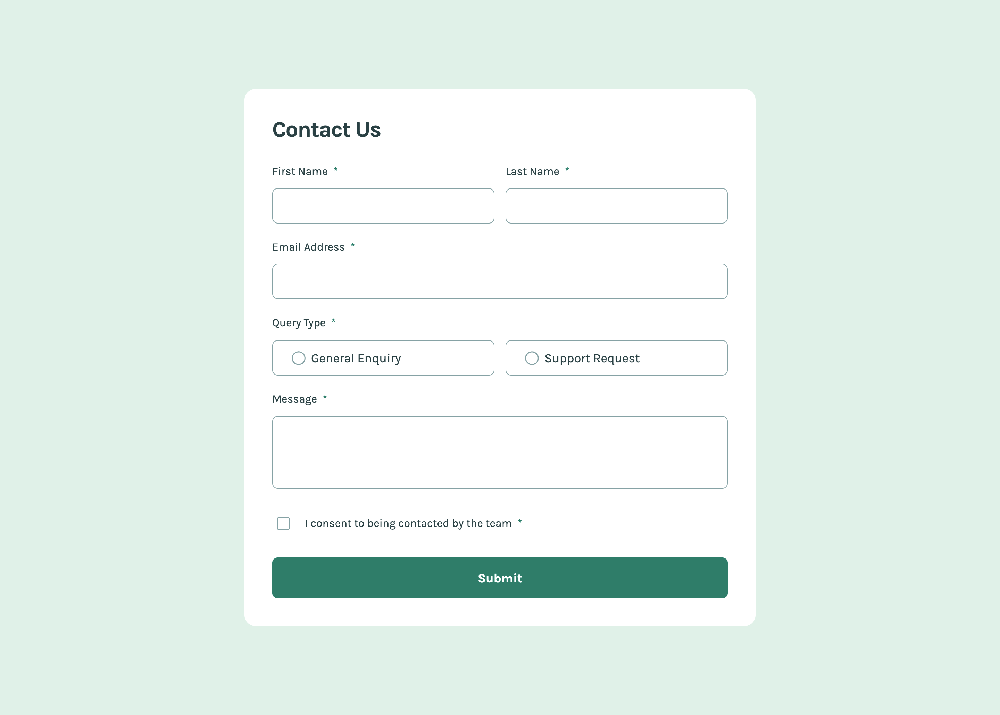
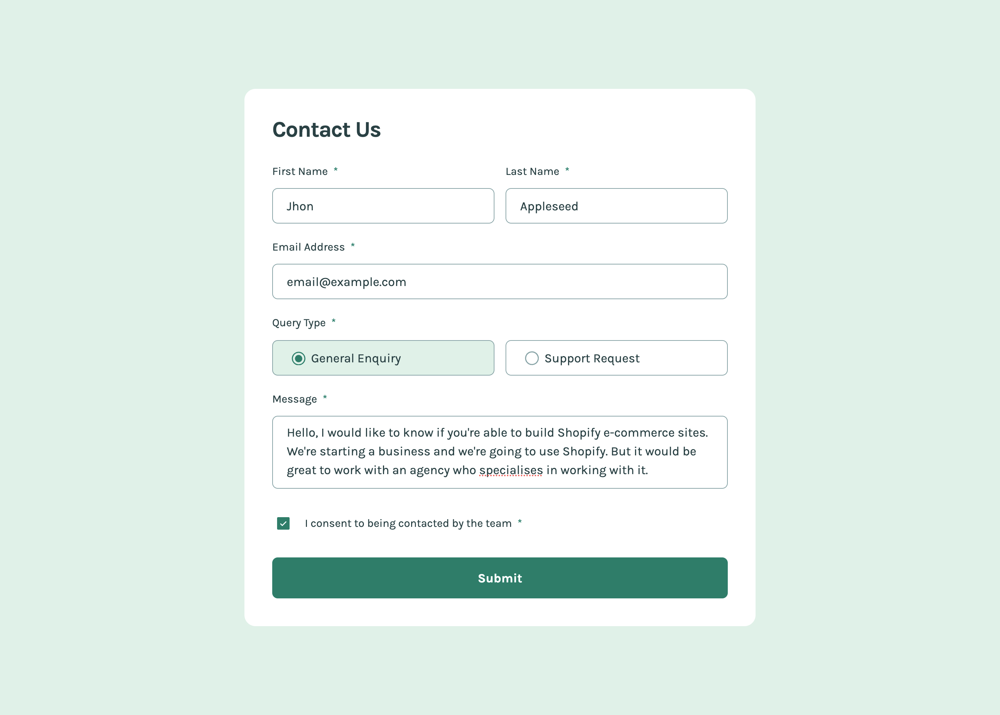
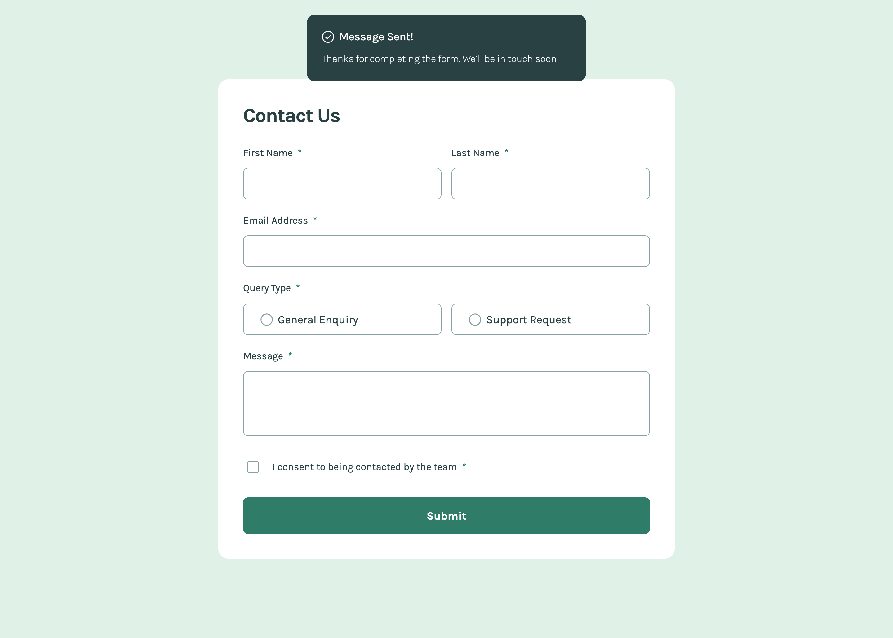
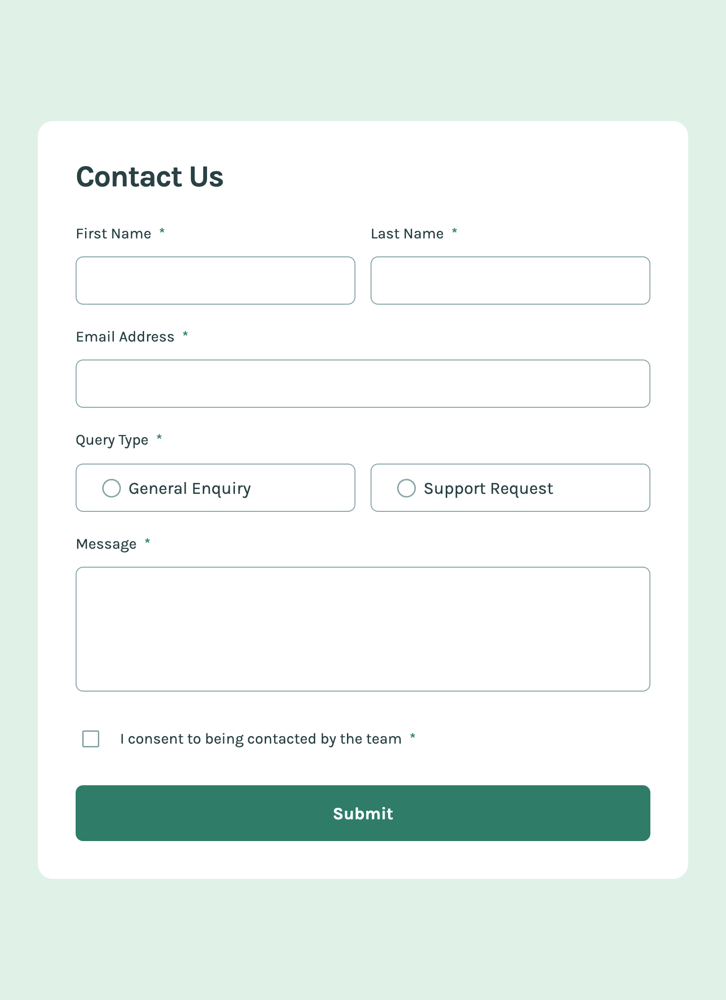
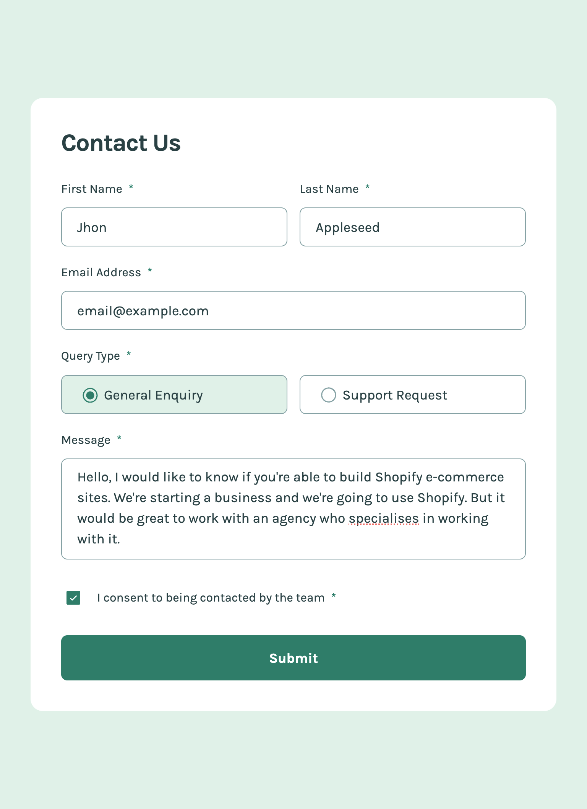
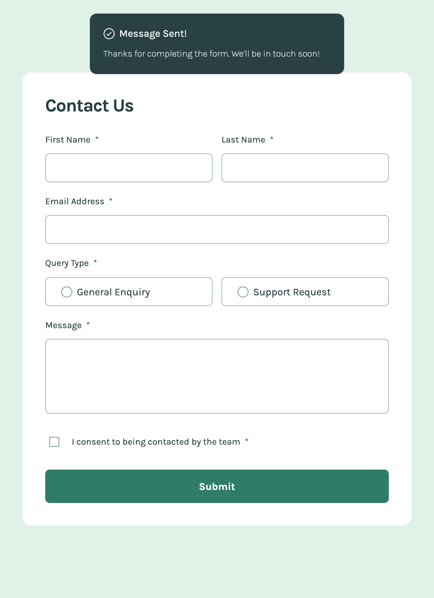
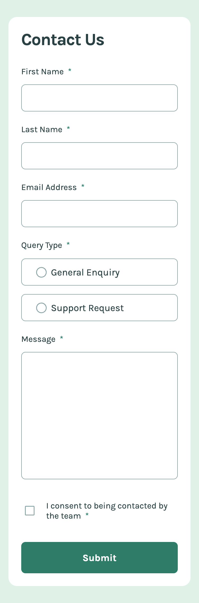
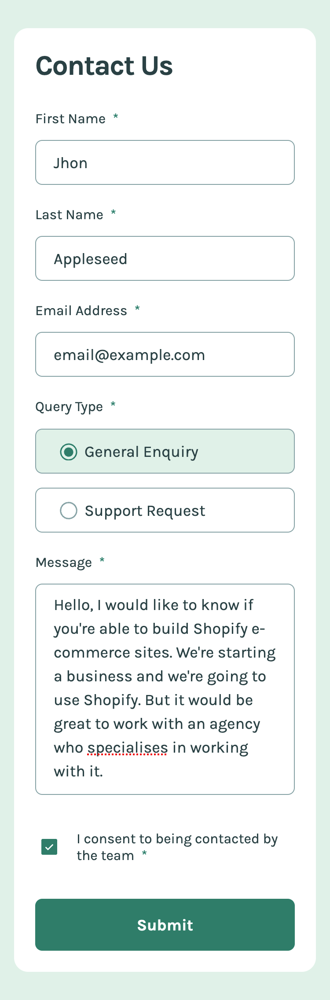
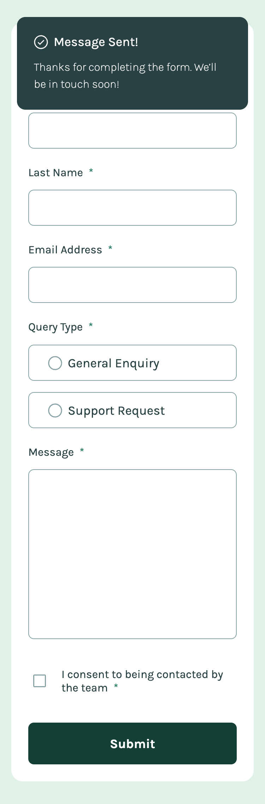

# Frontend Mentor - Accessible form

I coded this form with accessibility in mind. The idea for this form came from Frontend Mentor. Frontend Mentor provides challenges for frontend developers so they can make projects without the problem of designing the project. [See the challenge on Frontend Mentor.](https://www.frontendmentor.io/challenges/contact-form--G-hYlqKJj)

## The challenge

The challenge was to make a contact form that exactly looks like the given figma designs. The form needs to be accessible. It needs to be controlled by mouse and keyboard. Error messages needs to be clear and screen readers must read out te content so it will be clear for those who cant's see.

## Screenshots

  

## My experience

Creating the form was the first challenge but making it accessible was a second challenge. I read a lot of articles about it and tried a lot of things out in de code. I ended up learning voice over on mac and that changed the way a looked at making code accessible for blind people. It is really difficult to only navigate with keyboard and voice over. There are a lot of things to improve on but the form could be filled in with mouse and keyboard navigation and everything wil be read out by screen readers.

### Links

-   Solution URL: [github repository](https://github.com/Jolijn0101/accessible-form)
-   Live Site URL: [github page](https://jolijn0101.github.io/accessible-form/)
